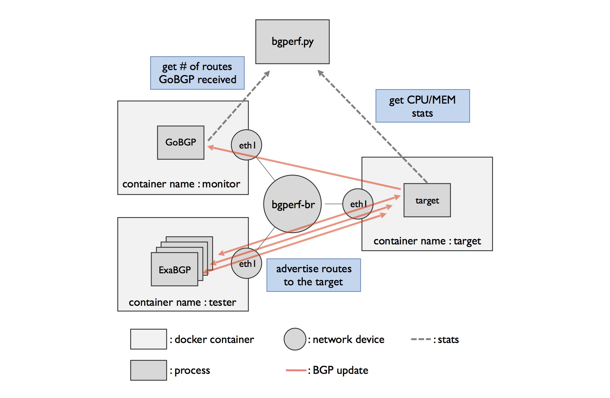

# How bgperf works



When `bench` command issued, `bgperf` boots three docker containers,
`target`, `tester` and `monitor` and connect them via a bridge `bgperf-br`.

By default, `bgperf` stores all configuration files and log files under `/tmp/bgperf`.
Here is what you can see after issuing `bgperf.py bench -n 10`.

```shell
$ tree /tmp/bgperf
/tmp/bgperf
├── gobgp
│   ├── gobgpd.conf
│   ├── gobgpd.log
│   └── start.sh
├── monitor
│   ├── gobgpd.conf
│   ├── gobgpd.log
│   └── start.sh
├── scenario.yaml
└── tester
    ├── 10.10.0.10.conf
    ├── 10.10.0.10.log
    ├── 10.10.0.11.conf
    ├── 10.10.0.11.log
    ├── 10.10.0.12.conf
    ├── 10.10.0.12.log
    ├── 10.10.0.3.conf
    ├── 10.10.0.3.log
    ├── 10.10.0.4.conf
    ├── 10.10.0.4.log
    ├── 10.10.0.5.conf
    ├── 10.10.0.5.log
    ├── 10.10.0.6.conf
    ├── 10.10.0.6.log
    ├── 10.10.0.7.conf
    ├── 10.10.0.7.log
    ├── 10.10.0.8.conf
    ├── 10.10.0.8.log
    ├── 10.10.0.9.conf
    ├── 10.10.0.9.log
    └── start.sh

3 directories, 28 files
```

`scenario.yaml` controls all the configuration of benchmark. You can pass your own scenario by using `-f` option.
By default, `bgperf` creates it automatically and places it under `/tmp/bgperf` like above. Let's see what's inside `scenario.yaml`.

```shell
$ cat /tmp/bgperf/scenario.yaml
monitor:
  as: 1001
  check-points: [1000]
  local-address: 10.10.0.2/16
  router-id: 10.10.0.2
target: {as: 1000, local-address: 10.10.0.1/16, router-id: 10.10.0.1}
tester:
  10.10.0.10:
    as: 1010
    local-address: 10.10.0.10/16
    paths: [100.0.2.188/32, 100.0.2.189/32, 100.0.2.190/32, 100.0.2.191/32, 100.0.2.192/32,
      100.0.2.193/32, 100.0.2.194/32, 100.0.2.195/32, 100.0.2.196/32, 100.0.2.197/32,
      100.0.2.198/32, 100.0.2.199/32, 100.0.2.200/32, 100.0.2.201/32, 100.0.2.202/32,
      100.0.2.203/32, 100.0.2.204/32, 100.0.2.205/32, 100.0.2.206/32, 100.0.2.207/32,
      100.0.2.208/32, 100.0.2.209/32, 100.0.2.210/32, 100.0.2.211/32, 100.0.2.212/32,
      100.0.2.213/32, 100.0.2.214/32, 100.0.2.215/32, 100.0.2.216/32, 100.0.2.217/32,
      100.0.2.218/32, 100.0.2.219/32, 100.0.2.220/32, 100.0.2.221/32, 100.0.2.222/32,
      100.0.2.223/32, 100.0.2.224/32, 100.0.2.225/32, 100.0.2.226/32, 100.0.2.227/32,
      100.0.2.228/32, 100.0.2.229/32, 100.0.2.230/32, 100.0.2.231/32, 100.0.2.232/32,
      100.0.2.233/32, 100.0.2.234/32, 100.0.2.235/32, 100.0.2.236/32, 100.0.2.237/32,
      100.0.2.238/32, 100.0.2.239/32, 100.0.2.240/32, 100.0.2.241/32, 100.0.2.242/32,
      100.0.2.243/32, 100.0.2.244/32, 100.0.2.245/32, 100.0.2.246/32, 100.0.2.247/32,
      100.0.2.248/32, 100.0.2.249/32, 100.0.2.250/32, 100.0.2.251/32, 100.0.2.252/32,
      100.0.2.253/32, 100.0.2.254/32, 100.0.2.255/32, 100.0.3.0/32, 100.0.3.1/32,
      100.0.3.2/32, 100.0.3.3/32, 100.0.3.4/32, 100.0.3.5/32, 100.0.3.6/32, 100.0.3.7/32,
      100.0.3.8/32, 100.0.3.9/32, 100.0.3.10/32, 100.0.3.11/32, 100.0.3.12/32, 100.0.3.13/32,
      100.0.3.14/32, 100.0.3.15/32, 100.0.3.16/32, 100.0.3.17/32, 100.0.3.18/32, 100.0.3.19/32,
      100.0.3.20/32, 100.0.3.21/32, 100.0.3.22/32, 100.0.3.23/32, 100.0.3.24/32, 100.0.3.25/32,
      100.0.3.26/32, 100.0.3.27/32, 100.0.3.28/32, 100.0.3.29/32, 100.0.3.30/32, 100.0.3.31/32]
    router-id: 10.10.0.10
  10.10.0.11:
    as: 1011
    local-address: 10.10.0.11/16
    paths: [100.0.3.32/32, 100.0.3.33/32, 100.0.3.34/32, 100.0.3.35/32, 100.0.3.36/32,
      100.0.3.37/32, 100.0.3.38/32, 100.0.3.39/32, 100.0.3.40/32, 100.0.3.41/32, 100.0.3.42/32,
      100.0.3.43/32, 100.0.3.44/32, 100.0.3.45/32, 100.0.3.46/32, 100.0.3.47/32, 100.0.3.48/32,
...(snip)...
```

It describes local address, as number and router-id of each cast.
With regard to tester, it also describes the routes to advertise to the target.

`check-points` field of `monitor` control when to end the benchmark.
During the benchmark, `bgperf.py` continuously checks how many routes `monitor` have got.
Benchmark ends when the number of received routes gets equal to check-point value.

